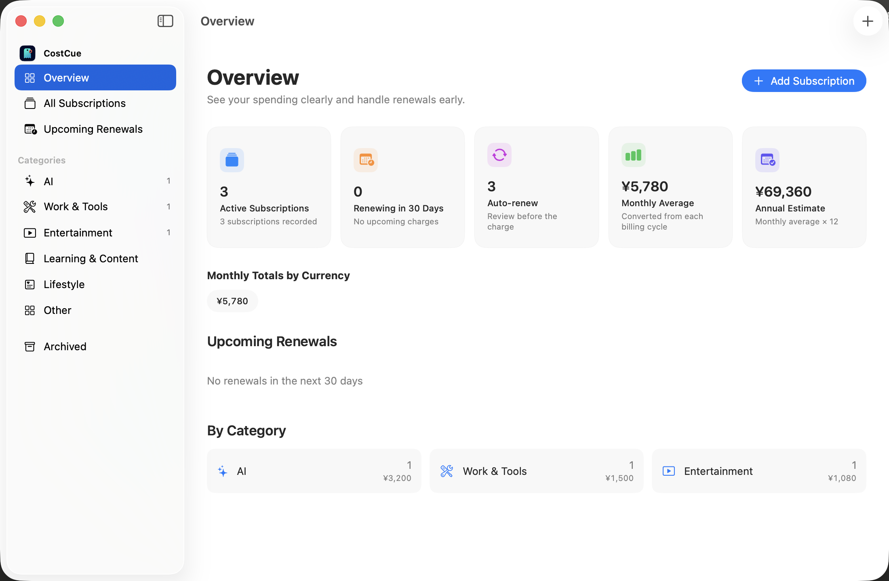

<div align="center">


# CostCue

### Know what renews next.

[](https://github.com/linqichenggg/CostCue/releases/latest)
[](https://github.com/linqichenggg/CostCue/releases/latest)
[](https://github.com/linqichenggg/CostCue/releases/latest)
[](#languages)
[](https://github.com/linqichenggg/CostCue/releases/latest)

English | [简体中文](README_ZH.md) | [日本語](README_JA.md)

</div>

> **Download:** [CostCue v1.1.4](https://github.com/linqichenggg/CostCue/releases/latest) from the official GitHub Releases page.

## Why CostCue?

Subscriptions are spread across app stores, websites, cards, and different currencies. It is easy to lose track of what is active, how much it costs, and when the next charge will happen.

CostCue brings those records into one native Mac app. Add subscriptions manually, review monthly and annual spending, receive local renewal reminders, and keep a complete payment history without creating an account.

## Screenshot



## Highlights

- **Clear spending overview** — See active subscriptions, monthly averages, annual estimates, automatic renewals, and upcoming charges.
- **Menu bar subscription list** — Keep the nearest renewal visible in the menu bar, then click it to review every non-archived subscription or open its details.
- **149 built-in products** — Choose familiar services such as ChatGPT, Claude, Gemini, WPS Office, iRightMouse, Apple Music, Netflix, Notion, and iCloud+, with icons available offline.
- **Flexible subscriptions** — Record monthly, annual, custom-interval, and lifetime purchases in multiple currencies.
- **Reliable renewal history** — Confirm or undo renewals, edit past payments, and schedule plan or price changes without losing historical details.
- **Local notifications** — Choose how many days before renewal CostCue should remind you. Clicking a notification opens the matching subscription.
- **Safe backup and restore** — Export all subscriptions, payment history, exchange rates, pending plan changes, and custom icons to one `.costcue.json` file. Import conflicts are reviewed before anything is replaced.
- **Custom products and icons** — Add services outside the built-in catalog with your own name and image.
- **Automatic in-app updates** — CostCue checks the official stable channel daily, verifies each update with an EdDSA signature, and can download and install it without opening another DMG. Manual checks remain available from the CostCue menu and Settings.
- **Native macOS experience** — Built with Swift and SwiftUI, with App Sandbox, Hardened Runtime, keyboard shortcuts, light and dark appearance, and no embedded web interface.

## Download and Installation

### Requirements

- macOS 14 Sonoma or later
- Apple Silicon or Intel Mac

### Free community build

CostCue is distributed free of charge from the [GitHub Releases](https://github.com/linqichenggg/CostCue/releases) page. Download the latest `CostCue-*-community.dmg`, open it, and drag `CostCue.app` into `Applications`.

When upgrading from v1.0.1, install v1.0.2 from the DMG once. Starting with v1.0.2, later releases can be downloaded, verified, and installed inside CostCue.

The free community build uses an ad-hoc code signature and has not been notarized by Apple. On first launch, macOS may require you to open **System Settings → Privacy & Security** and choose **Open Anyway**. GitHub displays the SHA-256 digest beside each downloadable asset, and CostCue verifies automatic-update archives with an EdDSA signature before installation.

Public releases contain the application packages and user documentation. The source code remains private.

## Getting Started

1. Open CostCue and choose the default currency.
2. Allow notifications when you want renewal reminders.
3. Select **Add Subscription**, choose a built-in product or enter a custom one, then fill in its price, billing cycle, and next renewal date.
4. Review spending and upcoming renewals from the Overview screen.
5. Open **CostCue → Settings** or press `⌘,` to change language, appearance, exchange rates, notifications, or backup data.

## Data and Privacy

CostCue has no account system, tracking, analytics, or advertising. Subscription data, payment history, preferences, and custom icons stay on the current Mac. Local notifications are scheduled by macOS, and backup import or export does not contact a server. Software updates only read the public appcast and download signed packages from GitHub; subscription data is never uploaded.

The SwiftData database is managed inside the app sandbox:

```text
~/Library/Containers/com.lqc.CostCue/Data/Library/Application Support/
```

Export a `.costcue.json` backup from Settings before uninstalling the app or clearing its data.

## Languages

CostCue supports Simplified Chinese, English, and Japanese. The first launch follows the preferred language configured in macOS; unsupported system languages use English. The language can be changed at any time inside CostCue Settings.

## FAQ

<details>
<summary><strong>Does CostCue automatically read my subscriptions?</strong></summary>

The first release uses manual entry. This keeps the app independent from third-party APIs and avoids sharing billing data with external services.

</details>

<details>
<summary><strong>Does CostCue support iCloud sync?</strong></summary>

The first release stores data on one Mac. iCloud and iPhone support are outside the current release scope.

</details>

<details>
<summary><strong>What happens when I change from monthly to annual billing?</strong></summary>

Choose whether the change takes effect immediately or at the next renewal. Existing payment records keep the plan, price, and billing cycle that applied at the time.

</details>

<details>
<summary><strong>Can I recover from an accidental renewal confirmation?</strong></summary>

Yes. The most recent renewal can be undone safely, restoring the previous renewal date and payment history.

</details>

## Feedback

Use [GitHub Issues](https://github.com/linqichenggg/CostCue/issues) to report reproducible problems or request product improvements.

## Copyright

Copyright © 2026 CostCue. All rights reserved.
