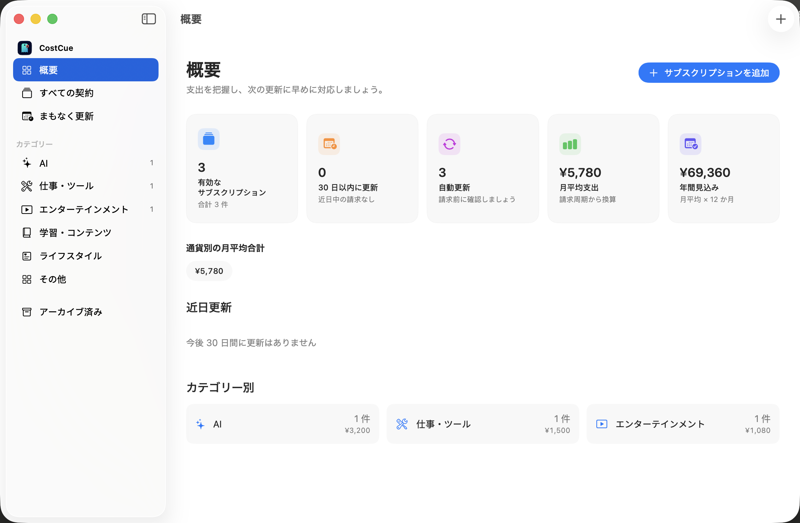

<div align="center">


# CostCue

### 次の更新を、ひと目で把握。

[](https://github.com/linqichenggg/CostCue/releases/latest)
[](https://github.com/linqichenggg/CostCue/releases/latest)
[](https://github.com/linqichenggg/CostCue/releases/latest)
[](#対応言語)
[](https://github.com/linqichenggg/CostCue/releases/latest)

[English](README.md) | [简体中文](README_ZH.md) | 日本語

</div>

> **ダウンロード：** 公式 [GitHub Releases](https://github.com/linqichenggg/CostCue/releases/latest) から CostCue v1.1.4 を入手できます。

## CostCue が必要な理由

サブスクリプションは、App Store、各サービスのウェブサイト、複数のカードや通貨に分散しています。契約中のサービス、毎月の支出、次の請求日を正確に把握し続けるのは簡単ではありません。

CostCue は、これらの情報を一つのネイティブ Mac アプリにまとめます。アカウント登録を行わずに、サブスクリプションの手動登録、月間・年間支出の確認、ローカル更新通知、支払い履歴の管理ができます。

## スクリーンショット



## 主な機能

- **分かりやすい支出概要** — 有効な契約、月平均、年間予測、自動更新、近日中の請求をまとめて確認できます。
- **メニューバーの一覧** — 直近の更新をメニューバーに常時表示し、クリックすると未アーカイブの全サブスクリプションを確認して詳細を開けます。
- **149 種類の内蔵サービス** — ChatGPT、Claude、Gemini、WPS Office、iRightMouse、Apple Music、Netflix、Notion、iCloud+ などをすぐに選択でき、アイコンはオフラインでも表示されます。
- **柔軟な請求サイクル** — 月払い、年払い、カスタム間隔、買い切りに対応し、複数通貨の元金額を保持します。
- **信頼できる更新履歴** — 更新の確定・取り消し、過去の支払い修正、プランや価格変更の予約を行っても、その時点の履歴を維持します。
- **ローカル更新通知** — 更新日の何日前に通知するかを選択でき、通知をクリックすると対象のサブスクリプションが開きます。
- **安全なバックアップと復元** — サブスクリプション、支払い履歴、手動為替レート、予約済みプラン変更、カスタムアイコンを一つの `.costcue.json` ファイルに保存します。競合は上書き前に確認できます。
- **カスタムサービスとアイコン** — 内蔵一覧にないサービスも、名前と画像を自由に設定できます。
- **アプリ内自動アップデート** — 公式の安定版チャンネルを毎日確認し、EdDSA 署名で検証してからダウンロードとインストールを行います。DMG を開き直す必要はなく、CostCue メニューと設定から手動確認もできます。
- **ネイティブ macOS 体験** — Swift と SwiftUI で構築し、App Sandbox、Hardened Runtime、キーボードショートカット、ライト・ダーク表示に対応しています。ウェブ画面を埋め込んだ構成は使用していません。

## ダウンロードとインストール

### 動作環境

- macOS 14 Sonoma 以降
- Apple Silicon または Intel Mac

### 無料コミュニティ版

CostCue は [GitHub Releases](https://github.com/linqichenggg/CostCue/releases) から無料で配布しています。最新の `CostCue-*-community.dmg` をダウンロードして開き、`CostCue.app` を「アプリケーション」フォルダへドラッグしてください。

v1.0.1 から更新する場合は、最後に一度だけ DMG から v1.0.2 をインストールしてください。v1.0.2 以降のバージョンは CostCue 内でダウンロード、検証、インストールできます。

無料コミュニティ版はアドホック署名を使用し、Apple の公証はまだ取得していません。初回起動時に macOS からブロックされた場合は、「システム設定 → プライバシーとセキュリティ」で「このまま開く」を選択します。GitHub は各ダウンロードファイルの横に SHA-256 ダイジェストを表示し、CostCue は自動更新をインストールする前に EdDSA 署名も検証します。

公開リリースでは、アプリのインストーラーとユーザー向けドキュメントを配布します。ソースコードは非公開の開発リポジトリで管理します。

## クイックスタート

1. CostCue を開き、既定の通貨を選択します。
2. 更新通知が必要な場合は通知を許可します。
3. 「サブスクリプションを追加」を選択し、内蔵サービスまたはカスタムサービスの価格、請求サイクル、次回更新日を入力します。
4. 「概要」で現在の支出と今後の更新を確認します。
5. 「CostCue → 環境設定」を開くか `⌘,` を押して、言語、外観、為替レート、通知、バックアップを管理します。

## データとプライバシー

CostCue には、アカウント、トラッキング、分析、広告がありません。サブスクリプション、支払い履歴、設定、カスタムアイコンは現在の Mac に保存されます。通知は macOS がローカルで予約し、バックアップの読み込みや書き出しもサーバーへ接続しません。ソフトウェア更新では公開 appcast を読み取り、署名済みパッケージを GitHub からダウンロードします。サブスクリプション情報はアップロードしません。

SwiftData データベースは、アプリのサンドボックス内で管理されます。

```text
~/Library/Containers/com.lqc.CostCue/Data/Library/Application Support/
```

アプリを削除したりデータを消去したりする前に、環境設定から `.costcue.json` バックアップを書き出してください。

## 対応言語

CostCue は簡体字中国語、英語、日本語に対応しています。初回起動時は macOS の優先言語に従い、対応していないシステム言語では英語を使用します。その後は CostCue の環境設定からいつでも変更できます。

## よくある質問

<details>
<summary><strong>サブスクリプションを自動で読み取りますか？</strong></summary>

最初のリリースでは手動入力を使用します。外部 API への依存を抑え、請求情報を外部サービスへ送信しない設計です。

</details>

<details>
<summary><strong>iCloud 同期に対応していますか？</strong></summary>

最初のリリースでは、一台の Mac にデータを保存します。iCloud と iPhone への対応は現在のリリース範囲に含まれていません。

</details>

<details>
<summary><strong>月払いから年払いへ変更すると、過去のデータは消えますか？</strong></summary>

消えません。変更をすぐに適用するか、次回更新時に適用するかを選択できます。過去の支払い記録には、その時点のプラン、価格、請求サイクルが保持されます。

</details>

<details>
<summary><strong>誤って更新を確定した場合、元に戻せますか？</strong></summary>

はい。直近の更新は安全に取り消すことができ、以前の更新日と支払い履歴が復元されます。

</details>

## フィードバック

再現可能な不具合や製品改善の提案は [GitHub Issues](https://github.com/linqichenggg/CostCue/issues) から送信できます。

## 著作権

Copyright © 2026 CostCue. All rights reserved.
