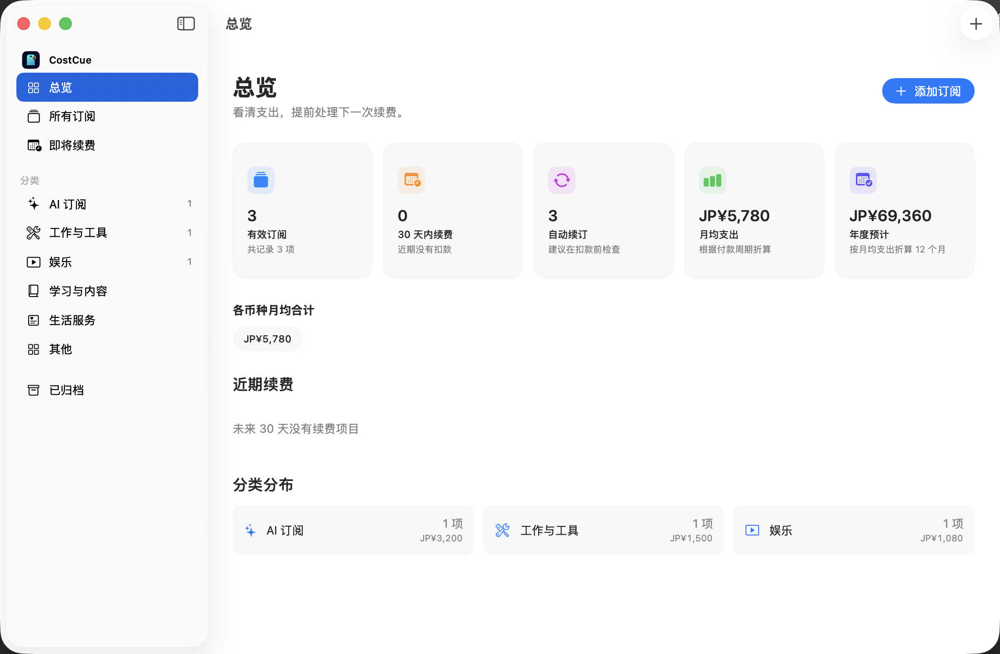

<div align="center">


# CostCue

### 清楚掌握下一笔续费。

[](https://github.com/linqichenggg/CostCue/releases/latest)
[](https://github.com/linqichenggg/CostCue/releases/latest)
[](https://github.com/linqichenggg/CostCue/releases/latest)
[](#语言)
[](https://github.com/linqichenggg/CostCue/releases/latest)

[English](README.md) | 简体中文 | [日本語](README_JA.md)

</div>

> **立即下载：** 从官方 [GitHub Releases](https://github.com/linqichenggg/CostCue/releases/latest) 获取 CostCue v1.0.2。

## 为什么需要 CostCue？

订阅分散在应用商店、产品网站、不同银行卡和多种货币中。时间一长，很容易忘记自己正在订阅什么、每月花费多少，以及下一次扣款时间。

CostCue 将这些记录集中到一款原生 Mac 应用中。你可以手动添加订阅、查看月均与年度支出、接收本地续费提醒，并在无需注册账号的情况下保留完整付款历史。

## 界面预览



## 核心功能

- **清晰的支出总览**：集中查看有效订阅、月均支出、年度预计、自动续订数量和近期扣款。
- **148 个内置产品**：直接选择 ChatGPT、Claude、Gemini、Apple Music、Netflix、Notion、iCloud+ 等常见服务，全部图标支持离线显示。
- **灵活的订阅周期**：支持月付、年付、自定义周期和一次性买断，并保留多币种原始金额。
- **可靠的续费历史**：确认或撤销续费、修正历史付款，并安排套餐或价格变更，同时保留当时真实生效的信息。
- **本地续费通知**：自由选择提前几天提醒，点击通知可直接打开对应订阅。
- **安全备份与恢复**：将订阅、付款历史、手动汇率、待生效套餐和自定义图标导出为一个 `.costcue.json` 文件；导入冲突会在覆盖前逐项确认。
- **自定义产品与图标**：内置目录之外的服务可以自行设置名称和图片。
- **应用内自动更新**：每天检查官方稳定通道，使用 EdDSA 签名验证更新，并可直接下载和安装，无需再次打开 DMG；CostCue 菜单和设置中仍可手动检查。
- **原生 macOS 体验**：使用 Swift 与 SwiftUI 构建，具备应用沙盒、Hardened Runtime、快捷键、深浅色模式，不包含网页套壳界面。

## 下载与安装

### 系统要求

- macOS 14 Sonoma 或更高版本
- Apple Silicon 或 Intel Mac

### 免费社区版

CostCue 通过 [GitHub Releases](https://github.com/linqichenggg/CostCue/releases) 免费提供。下载最新的 `CostCue-*-community.dmg`，打开后将 `CostCue.app` 拖入“应用程序”文件夹。

从 v1.0.1 升级时，需要最后一次通过 DMG 安装 v1.0.2。从 v1.0.2 开始，后续版本可直接在 CostCue 内下载、验证和安装。

免费社区版使用临时代码签名，未附带 Apple 公证票据。第一次打开时，macOS 可能要求进入“系统设置 → 隐私与安全性”，点击“仍要打开”。GitHub 会在每个下载文件旁显示 SHA-256 摘要，CostCue 还会在安装自动更新前验证 EdDSA 签名。

公开仓库只提供应用安装包和用户文档，源代码继续保留在私有开发仓库中。

## 快速开始

1. 打开 CostCue，选择默认货币。
2. 需要续费提醒时允许系统通知。
3. 点击“添加订阅”，选择内置产品或填写自定义产品，然后设置价格、付款周期和下次续费日期。
4. 在“总览”查看当前支出与近期续费。
5. 打开“CostCue → 设置”或按下 `⌘,`，管理语言、外观、汇率、通知和数据备份。

## 数据与隐私

CostCue 没有账号系统、用户追踪、数据分析和广告。订阅记录、付款历史、偏好设置和自定义图标只保存在当前 Mac。本地通知由 macOS 安排，导入和导出备份时也不会连接服务器。软件更新只读取公开 appcast，并从 GitHub 下载带签名的安装包，不会上传订阅数据。

SwiftData 数据库由系统管理在应用沙盒内：

```text
~/Library/Containers/com.lqc.CostCue/Data/Library/Application Support/
```

卸载应用或清空数据前，请先在设置中导出 `.costcue.json` 备份。

## 语言

CostCue 支持简体中文、英语和日语。首次运行会根据 macOS 首选语言自动选择；其他系统语言使用英语。之后可以随时在 CostCue 设置中切换。

## 常见问题

<details>
<summary><strong>CostCue 会自动读取我的订阅吗？</strong></summary>

首个版本采用全手动录入。这样可以减少对第三方 API 的依赖，也不会把账单信息发送给外部服务。

</details>

<details>
<summary><strong>支持 iCloud 同步吗？</strong></summary>

首个版本的数据保存在一台 Mac 上。iCloud 和 iPhone 支持暂未进入当前版本范围。

</details>

<details>
<summary><strong>月付改成年付时，之前的数据会消失吗？</strong></summary>

不会。你可以选择立即生效或下次续费时生效，原有付款记录会继续保留当时的套餐、价格和付款周期。

</details>

<details>
<summary><strong>误点“确认已续费”后可以恢复吗？</strong></summary>

可以。最近一次续费支持安全撤销，应用会恢复之前的续费日期和付款历史。

</details>

## 反馈

可以通过 [GitHub Issues](https://github.com/linqichenggg/CostCue/issues) 提交可复现的问题和产品改进建议。

## 版权

Copyright © 2026 CostCue. All rights reserved.
